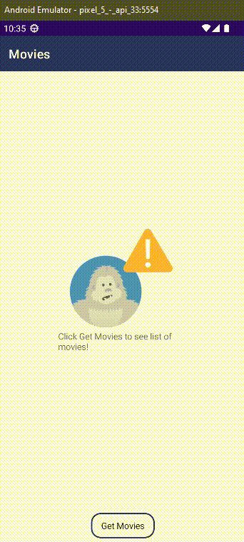
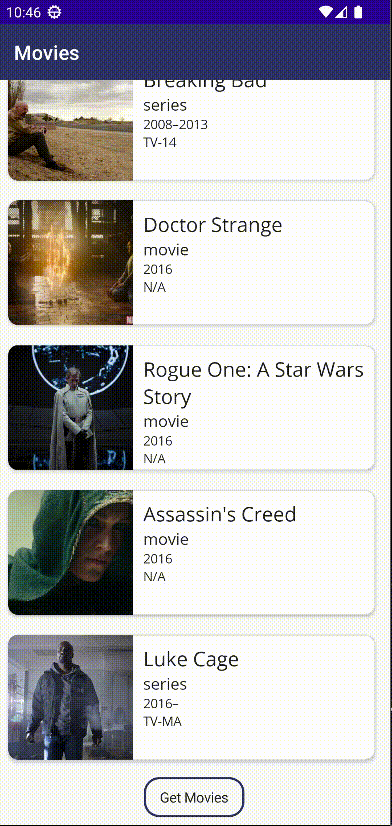
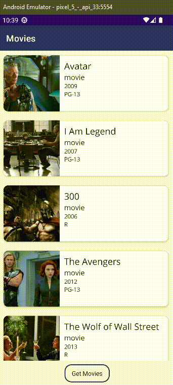
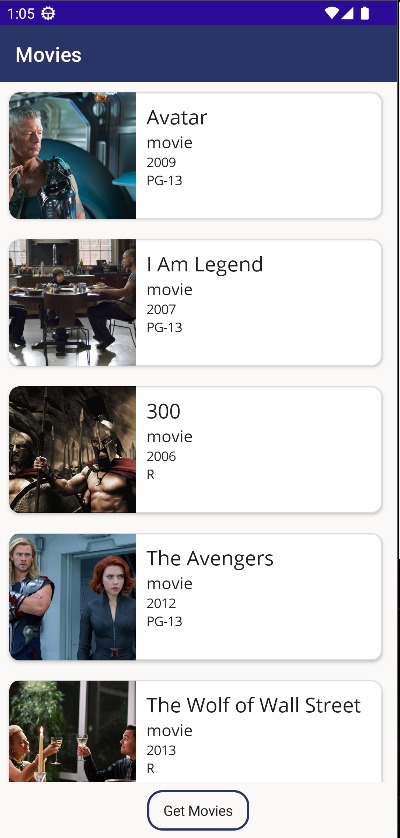
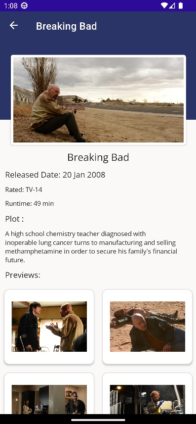
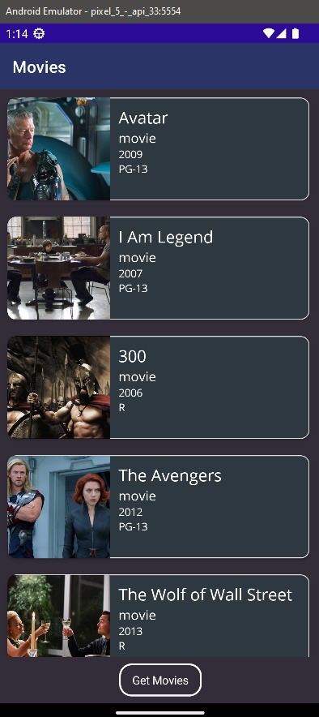
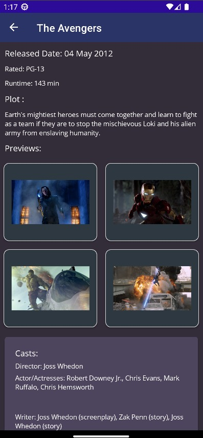

# Framework Programming Assignment

> 5025201161

> Venia Sollery Aliyya Hasna


This application is able to display films and series when `Get Movies` button is clicked it will load and display the movies and series. Users can click on a specific movie or series to get the detailed information. The application is equipped with adaptive theme, so users can change between light and dark theme.

### Find another JSON dataset and use it in your project.
##

For this assignment, I chose to use a JSON data about movies and series. This database includes the Title, Rated, Year of Released, and etc.

```json
[
    ...
    {
        "Title": "300",
        "Year": "2006",
        "Rated": "R",
        "Released": "09 Mar 2007",
        "Runtime": "117 min",
        "Genre": "Action, Drama, Fantasy",
        "Director": "Zack Snyder",
        "Writer": "Zack Snyder (screenplay), Kurt Johnstad (screenplay), Michael Gordon (screenplay), Frank Miller (graphic novel), Lynn Varley (graphic novel)",
        "Actors": "Gerard Butler, Lena Headey, Dominic West, David Wenham",
        "Plot": "King Leonidas of Sparta and a force of 300 men fight the Persians at Thermopylae in 480 B.C.",
        "Language": "English",
        "Country": "USA",
        "Awards": "16 wins & 42 nominations.",
        "Poster": "http://ia.media-imdb.com/images/M/MV5BMjAzNTkzNjcxNl5BMl5BanBnXkFtZTYwNDA4NjE3._V1_SX300.jpg",
        "Metascore": "52",
        "imdbRating": "7.7",
        "imdbVotes": "611,046",
        "imdbID": "tt0416449",
        "Type": "movie",
        "Response": "True",
        "Images": [
          "https://images-na.ssl-images-amazon.com/images/M/MV5BMTMwNTg5MzMwMV5BMl5BanBnXkFtZTcwMzA2NTIyMw@@._V1_SX1777_CR0,0,1777,937_AL_.jpg",
          "https://images-na.ssl-images-amazon.com/images/M/MV5BMTQwNTgyNTMzNF5BMl5BanBnXkFtZTcwNDA2NTIyMw@@._V1_SX1777_CR0,0,1777,935_AL_.jpg",
          "https://images-na.ssl-images-amazon.com/images/M/MV5BMTc0MjQzOTEwMV5BMl5BanBnXkFtZTcwMzE2NTIyMw@@._V1_SX1777_CR0,0,1777,947_AL_.jpg"
        ]
      },
      {
        "Title": "The Avengers",
        "Year": "2012",
        "Rated": "PG-13",
        "Released": "04 May 2012",
        "Runtime": "143 min",
        "Genre": "Action, Sci-Fi, Thriller",
        "Director": "Joss Whedon",
        "Writer": "Joss Whedon (screenplay), Zak Penn (story), Joss Whedon (story)",
        "Actors": "Robert Downey Jr., Chris Evans, Mark Ruffalo, Chris Hemsworth",
        "Plot": "Earth's mightiest heroes must come together and learn to fight as a team if they are to stop the mischievous Loki and his alien army from enslaving humanity.",
        "Language": "English, Russian",
        "Country": "USA",
        "Awards": "Nominated for 1 Oscar. Another 34 wins & 75 nominations.",
        "Poster": "http://ia.media-imdb.com/images/M/MV5BMTk2NTI1MTU4N15BMl5BanBnXkFtZTcwODg0OTY0Nw@@._V1_SX300.jpg",
        "Metascore": "69",
        "imdbRating": "8.1",
        "imdbVotes": "1,003,301",
        "imdbID": "tt0848228",
        "Type": "movie",
        "Response": "True",
         "Images": [
          "https://images-na.ssl-images-amazon.com/images/M/MV5BMTA0NjY0NzE4OTReQTJeQWpwZ15BbWU3MDczODg2Nzc@._V1_SX1777_CR0,0,1777,999_AL_.jpg",
          "https://images-na.ssl-images-amazon.com/images/M/MV5BMjE1MzEzMjcyM15BMl5BanBnXkFtZTcwNDM4ODY3Nw@@._V1_SX1777_CR0,0,1777,999_AL_.jpg",
          "https://images-na.ssl-images-amazon.com/images/M/MV5BMjMwMzM2MTg1M15BMl5BanBnXkFtZTcwNjM4ODY3Nw@@._V1_SX1777_CR0,0,1777,999_AL_.jpg",
          "https://images-na.ssl-images-amazon.com/images/M/MV5BMTQ4NzM2Mjc5MV5BMl5BanBnXkFtZTcwMTkwOTY3Nw@@._V1_SX1777_CR0,0,1777,999_AL_.jpg",
          "https://images-na.ssl-images-amazon.com/images/M/MV5BMTc3MzQ3NjA5N15BMl5BanBnXkFtZTcwMzY5OTY3Nw@@._V1_SX1777_CR0,0,1777,999_AL_.jpg"
        ]
      },

  ...
  ]
  
  ```
  The JSON file can be found in `/Movies/Movies/Resources/Raw/Movies.json `
  
  ##


### Create an application with two screens: the main screen and the detail screen.
##

<div align="center">  
  <span></span>
  <!--invisible-->
  <span></span>
</div>

<div align="center">  
  <span>Main Page</span>
  <!--invisible-->
  <span>Details Page</span>
</div>

 <!--invisible-->
 
The users can click on the `Get Movies` which will display all movies/series in the Main Page. The data is fetch from the internet using a http request. In addition, if the users wants to know more information about a specific movie/series they can click on the movie/series, which will lead them to the details page.

Fetching data from internet: 

```c#
var url = "https://raw.githubusercontent.com/Vsollery/FrameworkProg-Assignment04/main/Movies/Movies/Resources/Raw/Movies.json";

var response = await httpClient.GetAsync(url);

if (response.IsSuccessStatusCode)
{
    moviesList = await response.Content.ReadFromJsonAsync<List<Movie>>();
}

```

```c#
async Task GetMoviesAsync()
{
    if(IsBusy) return;
    try
    {
        if(connectivity.NetworkAccess != NetworkAccess.Internet)
        {
            await Shell.Current.DisplayAlert("Internet Issue", $"Check Your Internet and Try Again", "OK");
            return;
        }
        IsBusy = true;
        var movies = await moviesService.GetMovies();

        if(Movies.Count != 0)
            Movies.Clear();

        foreach(var movie in movies)
        {
            Movies.Add(movie);
        }

    }catch(Exception ex)
    {   
       Debug.WriteLine(ex);
        await Shell.Current.DisplayAlert("Error!", $"Unable to get Movies: {ex.Message}", "OK");
    }
    finally 
    { 
        IsBusy = false;
        isRefreshing = false;
    }
}
```

Go to details page:

```c#
async Task GotoDetailsASync(Movie movie)
{
    if(movie is null) return;

    await Shell.Current.GoToAsync($"{nameof(DetailsPage)}",true,
        new Dictionary<string, object>
        {
            {"Movie", movie }
        });
}
```


 


##

### Application should be able to detect the internet connection status.
##

<div align="center">
    
</div>

<!--invisible-->

From the result above, the internet is turned off. And when we try to press `Get Movie` button it will not load, but instead it will display an alert informing user to check their interner connection.

Checking Internet:

```c#
if(connectivity.NetworkAccess != NetworkAccess.Internet)
    {
        await Shell.Current.DisplayAlert("Internet Issue", $"Check Your Internet and Try Again", "OK");
        return;
    }
```

##

### Add the adaptive theme functionality to your apps.
##

<div align="center">  
 <P> LIGHT THEME </p>
</div>

<div align="center">  
  <span></span>
  <!--invisible-->
  <span></span>
</div>

<!--invisible-->

<div align="center">  
 <p>DARK THEME</p>
</div>

<div align="center">  
  <span></span>
  <!--invisible-->
  <span></span>
</div>
 <!--invisible-->
 
 Example:
 
 ```c#
 <Style x:Key="ButtonOutline" TargetType="Button">
    <Setter Property="BackgroundColor" Value="{AppThemeBinding Light={StaticResource LightBackground}, Dark={StaticResource DarkBackground}}"/>
    <Setter Property="TextColor" Value="{AppThemeBinding Light={StaticResource LabelText}, Dark={StaticResource LabelTextDark}}" />
    <Setter Property="BorderColor" Value="{AppThemeBinding Light={StaticResource newDark}, Dark={StaticResource LightBackground}}"/>
    <Setter Property="BorderWidth" Value="2"/>
    <Setter Property="HeightRequest" Value="40"/>
    <Setter Property="CornerRadius" Value="15"/>
</Style>
 ```
 
Above is an example targeting the Button. So when a button using `Style="{StaticResource ButtonOutline}"` it will automatically apply all the styles that has been set.

The AppThemeBinding markup extension can be used to consume resources for both light and dark themes. Using this method, resources are automatically assigned in accordance with the value of the active system theme.

